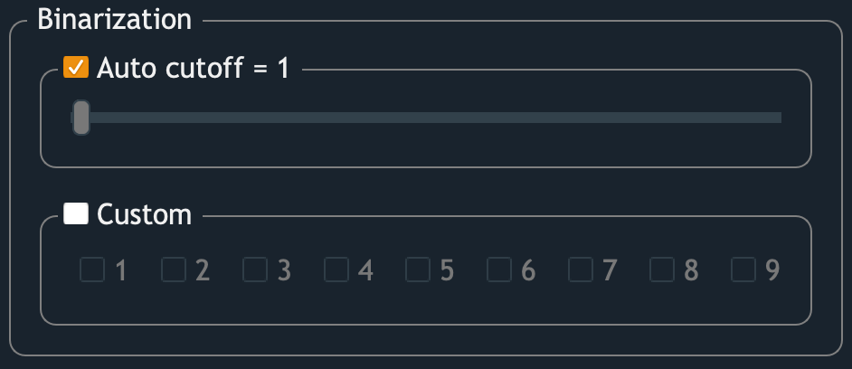

K-Means Clustering
==================

In this step, 
GRID will help users to extract pixel of interest (POI) from the AOI.
POI is colored in yellow, whereas the remaining areas are shown as black pixels.
Pixels contain soil, non-vegetation objects, 
and field residuals can be excluded in this step. 
There're also refining tools avaialble to remove shadow and image noise

    A panel for defining pixel of interest (POI)

Clustering
----------

GRID uses K-means clustering algorithm to cluster imagery pixels.
2 parameters are available to be tuned:

.. figure:: res/km_alg.png
   :width: 450 px
   :align: center

   The interface of K-means clustering algorithm

* **Channels used for clustering** 
    By checking the box, the corresponding channel will be included 
    in the feature space for clustering.
    The checkable boxes are imagery channels found from the inputs.
    For example, in a JPEG image, "1" is the red channel, 
    which should also be the first channel of a JPEG image.

* **K**
    It's how many clusters expected to exist in the image. 

    Comparison between the raw image, 3-cluster image, and 5-cluster image.

Binarization
------------

This section allows you to assign which clusters belong to POI. 
The image will then be binarized into a yellow/black image 
showing POI and non-POI, respectively.

   The interface of binarization

2 ways to do the binarization:

* **Auto cutoff**
    GRID will rank clusters based on the possibility of being POI.
    When auto cutoff = **m**, 
    the first **m** cluters will be assigned to AOI (yellow).

* **Custom**
    You can also assign POI in the original order of clusters 
    (which usually is arbitrary from K-means clustering algorithm). 
    The checked box will be assign to POI.

Refine POI
-----------

Display/Zoom
------------
